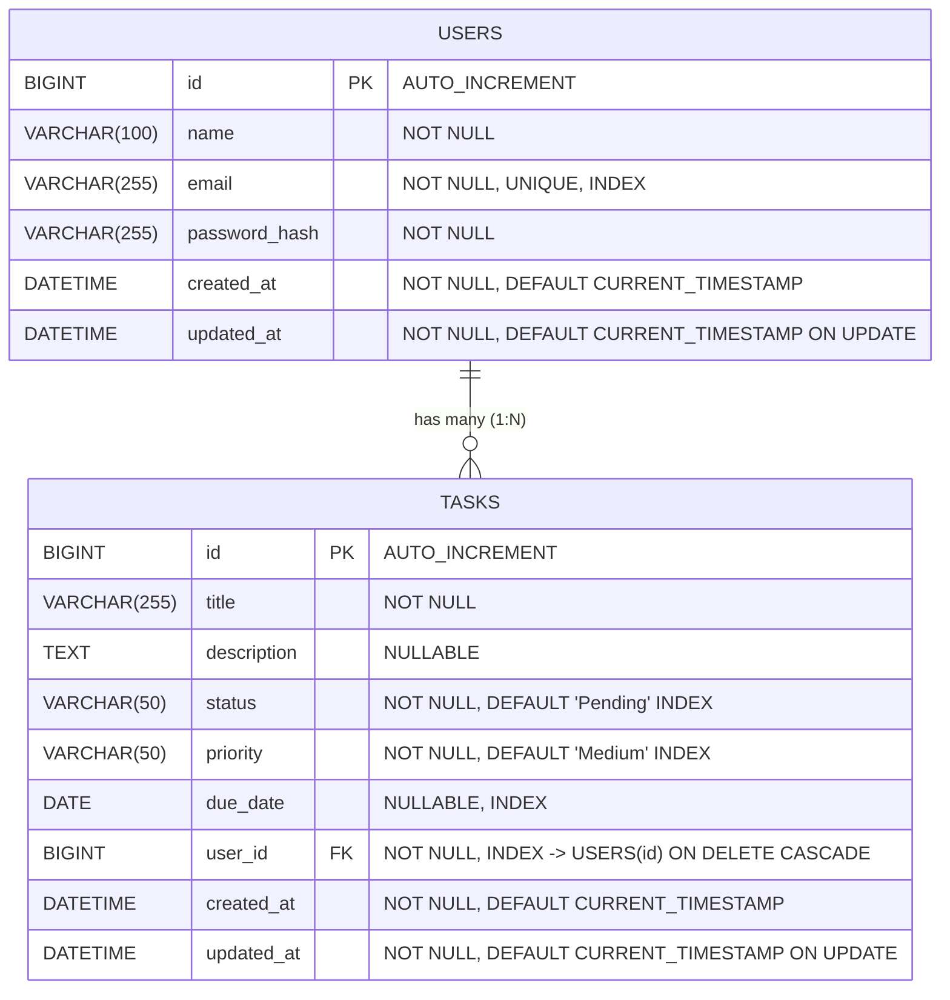

# 🚀 Full-Stack Task Management System

A production-grade, full-stack Task Management System engineered with **Python 3, FastAPI, SQLAlchemy 2.0 ORM, MySQL, Alembic, React 18, Vite, and Tailwind CSS**.

This project demonstrates professional software engineering standards, including layered **MVC / Service-Oriented Architecture**, **JWT authentication**, **cryptographic password hashing**, **database migrations**, **multi-tenant data isolation**, **server-side analytics aggregations**, **ORM relationships & joins**, **Axios interceptors**, **React Context API**, and automated **End-to-End verification test suites**.

---

## 📑 Table of Contents

- [Features](#-features)
- [Tech Stack](#-tech-stack)
- [Architecture & Design](#-architecture--design)
- [Directory Structure](#-directory-structure)
- [Database Schema & ERD](#-database-schema--erd)
- [REST API Specification](#-rest-api-specification)
- [Environment Setup & Installation](#-environment-setup--installation)
  - [Prerequisites](#prerequisites)
  - [Backend Setup](#1-backend-setup)
  - [MySQL & Alembic Migrations](#2-mysql--alembic-migrations)
  - [Frontend Setup](#3-frontend-setup)
- [Running the Application](#-running-the-application)
- [Running Automated Tests](#-running-automated-tests)
- [Postman Collection Guide](#-postman-collection-guide)
- [UI & Screenshots](#-ui--screenshots)
- [Future Improvements](#-future-improvements)

---

## ✨ Features

### 🔐 Authentication & Security
- **JWT Authentication**: Stateless token issuance using HMAC-SHA256 (`HS256`) with automatic client-side header attachment.
- **Cryptographic Password Hashing**: Passwords salted and hashed with `bcrypt` (12 rounds) before storage; plain passwords are never stored or logged.
- **Protected Routes**: FastAPI dependency injection (`get_current_user`) guards API endpoints; React route guards (`ProtectedRoute`, `PublicRoute`) manage client-side access.
- **Multi-Tenant Isolation**: Users can only read, update, or delete tasks belonging to their own account.
- **Auto Session Hydration**: Automatic token verification on refresh and auto-logout on token expiration via Axios interceptors.

### 📋 Task Management
- **Full CRUD Support**: Create, read (paginated), update, patch status, and delete tasks.
- **Status Workflows**: `Pending` $\to$ `In Progress` $\to$ `Completed`.
- **Prioritization**: Categorize tasks into `Low`, `Medium`, and `High` urgency levels.
- **Deadlines & Overdue Indicators**: Assign due dates with automated red alerts for overdue items.
- **Real-Time Search & Filtering**: Multi-criteria filter bar supporting keyword search across titles and descriptions, status filtering, priority filtering, and due date selection.

### 📊 Dashboard & Analytics
- **Summary Metrics**: Real-time KPI cards for Total Tasks, Pending, In Progress, Completed, High Priority, and Overdue tasks.
- **Completion Rate Progress**: Interactive percentage completion progress bar.
- **Recent Activity Feed**: Timeline of latest tasks with quick inline status toggles.

### 🎨 User Experience
- **Responsive Design**: Tailored for Mobile, Tablet, and Desktop using Tailwind CSS.
- **Smooth Feedback**: Toast notification system (`ToastProvider`), animated Skeleton loaders, and React Error Boundaries.

---

## 🛠 Tech Stack

| Tier | Technologies |
| :--- | :--- |
| **Backend** | Python 3.11+, FastAPI, Uvicorn, SQLAlchemy 2.0 ORM, Alembic, PyMySQL, Cryptography, Pydantic v2, Pydantic Settings, Python-Jose (JWT), Bcrypt |
| **Frontend** | React 18, Vite, Tailwind CSS, React Router DOM v6, Axios, Lucide React Icons |
| **Database** | MySQL 8.0+ (InnoDB engine) / SQLite (for in-memory testing) |
| **Testing** | Automated Python E2E Test Suite (`test_e2e.py`), Postman Collection v2.1 |
| **Version Control** | Git & GitHub with Conventional Commits |

---

## 🏛 Architecture & Design

The backend uses a layered **MVC / Service-Oriented Architecture** that separates HTTP concerns from business logic and database persistence:

```
[ HTTP Request (React Client) ]
              │
              ▼
    [ Routing Layer (app/routes/) ] ────────► Handles URL mapping & dependency injection
              │
              ▼
  [ Controller Layer (app/controllers/) ] ──► Validates payload & wraps standard JSON envelope
              │
              ▼
    [ Service Layer (app/services/) ] ──────► Pure business logic & access control
              │
              ▼
   [ Data Access Layer (app/models/) ] ────► SQLAlchemy 2.0 ORM Models
              │
              ▼
     [ MySQL Database (InnoDB) ]
```

### Response Contract
Every API response adheres to a predictable envelope:

```json
{
  "success": true,
  "message": "Operation completed successfully.",
  "data": {}
}
```

---

## 📂 Directory Structure

```text
task-management-system/
│
├── backend/
│   ├── alembic/                    # Alembic schema version tracking
│   │   ├── versions/
│   │   │   ├── 001_create_users_table.py
│   │   │   └── 002_create_tasks_table.py
│   │   ├── env.py                  # Migration runtime environment
│   │   └── script.py.mako
│   ├── alembic.ini                 # Migration tool configuration
│   ├── app/
│   │   ├── config/
│   │   │   └── settings.py         # Strongly-typed environment settings (Pydantic)
│   │   ├── database/
│   │   │   ├── base.py             # DeclarativeBase & TimestampMixin
│   │   │   └── database.py         # SQLAlchemy engine & SessionLocal dependency
│   │   ├── models/
│   │   │   ├── user.py             # User ORM model
│   │   │   └── task.py             # Task ORM model
│   │   ├── schemas/
│   │   │   ├── common_schema.py    # Generic APIResponse & ErrorResponse
│   │   │   ├── auth_schema.py      # Login & Token DTOs
│   │   │   ├── user_schema.py      # Profile & User DTOs
│   │   │   └── task_schema.py      # Task CRUD, Filter & Stats DTOs
│   │   ├── services/
│   │   │   ├── auth_service.py     # Auth & credential validation logic
│   │   │   ├── user_service.py     # Profile management logic
│   │   │   └── task_service.py     # Task CRUD, filters, joins & stats logic
│   │   ├── controllers/
│   │   │   ├── auth_controller.py  # Auth request handlers
│   │   │   ├── user_controller.py  # User request handlers
│   │   │   └── task_controller.py  # Task request handlers
│   │   ├── routes/
│   │   │   ├── api.py              # Root /api router aggregator
│   │   │   ├── auth_routes.py      # /api/auth routes
│   │   │   ├── user_routes.py      # /api/users routes
│   │   │   └── task_routes.py      # /api/tasks routes
│   │   ├── helpers/
│   │   │   ├── password_helper.py  # bcrypt hashing & verification
│   │   │   ├── jwt_helper.py       # JWT encoding/decoding & get_current_user guard
│   │   │   └── response_helper.py  # Standard JSON response wrappers
│   │   └── main.py                 # FastAPI application factory & CORS setup
│   ├── requirements.txt            # Python dependencies
│   ├── test_e2e.py                 # Automated 17-test E2E verification suite
│   ├── .env.example
│   └── .gitignore
│
├── frontend/
│   ├── src/
│   │   ├── components/
│   │   │   ├── common/             # Button, Input, Modal, Badge, Skeleton, Toast, ErrorBoundary
│   │   │   ├── layout/             # Navbar, Sidebar, AppLayout, ProtectedRoute, PublicRoute
│   │   │   ├── dashboard/          # StatCard
│   │   │   └── tasks/              # TaskCard, TaskFilterBar, TaskFormModal
│   │   ├── context/
│   │   │   ├── AuthContext.jsx     # Authentication state provider
│   │   │   └── ToastContext.jsx    # Toast notifications provider
│   │   ├── pages/
│   │   │   ├── Login.jsx
│   │   │   ├── Register.jsx
│   │   │   ├── Dashboard.jsx
│   │   │   ├── Tasks.jsx
│   │   │   ├── Profile.jsx
│   │   │   └── NotFound.jsx
│   │   ├── services/
│   │   │   ├── api.js              # Axios instance + JWT interceptors
│   │   │   ├── authService.js
│   │   │   ├── userService.js
│   │   │   └── taskService.js
│   │   ├── routes/
│   │   │   └── AppRoutes.jsx
│   │   ├── utils/
│   │   │   └── constants.js
│   │   ├── App.jsx
│   │   ├── main.jsx
│   │   └── index.css
│   ├── tailwind.config.js
│   ├── vite.config.js
│   ├── package.json
│   ├── .env.example
│   └── .gitignore
│
├── postman/
│   ├── Task-Management.postman_collection.json
│   └── Task-Management.postman_environment.json
│
├── .gitignore
└── README.md
```

---

## 🗄 Database Schema & ERD



---

## 🔌 REST API Specification

### Authentication Module (`/api/auth`)
| Method | Endpoint | Access | Description | Status Code |
| :--- | :--- | :--- | :--- | :--- |
| `POST` | `/api/auth/register` | Public | Register new user account | `201 Created` |
| `POST` | `/api/auth/login` | Public | Authenticate credentials & receive JWT token | `200 OK` |
| `POST` | `/api/auth/logout` | Authenticated | Log out current session | `200 OK` |

### User Profile Module (`/api/users`)
| Method | Endpoint | Access | Description | Status Code |
| :--- | :--- | :--- | :--- | :--- |
| `GET` | `/api/users/me` | Authenticated | Get current authenticated user profile | `200 OK` |
| `PUT` | `/api/users/me` | Authenticated | Update user name, email, or password | `200 OK` |

### Tasks Module (`/api/tasks`)
| Method | Endpoint | Access | Query Parameters / Payload | Description | Status Code |
| :--- | :--- | :--- | :--- | :--- | :--- |
| `POST` | `/api/tasks` | Authenticated | `{ title, description?, status?, priority?, due_date? }` | Create new task | `201 Created` |
| `GET` | `/api/tasks` | Authenticated | `status`, `priority`, `due_date`, `search`, `page`, `limit` | Paginated & filtered tasks | `200 OK` |
| `GET` | `/api/tasks/stats` | Authenticated | None | Summary dashboard counts | `200 OK` |
| `GET` | `/api/tasks/{id}` | Authenticated | Path param: `id` | Single task with joined owner info | `200 OK` |
| `PUT` | `/api/tasks/{id}` | Authenticated | `{ title, description?, status?, priority?, due_date? }` | Update full task | `200 OK` |
| `PATCH`| `/api/tasks/{id}/status`| Authenticated | `{ status: "Pending" \| "In Progress" \| "Completed" }` | Atomic status patch | `200 OK` |
| `DELETE`| `/api/tasks/{id}` | Authenticated | Path param: `id` | Delete task | `200 OK` |

---

## ⚙️ Environment Setup & Installation

### Prerequisites
- **Python 3.10+** (Tested on Python 3.11.9)
- **Node.js 18+** & **npm 9+** (Tested on Node v22.15.0)
- **MySQL 8.0+** or MariaDB (optional: SQLite supported out of the box for quick offline testing)

---

### 1. Backend Setup

1. Open terminal and navigate to the backend directory:
   ```powershell
   cd backend
   ```

2. Create and activate a Python virtual environment:
   ```powershell
   # Windows PowerShell
   python -m venv venv
   .\venv\Scripts\Activate.ps1
   ```

3. Install all required dependencies:
   ```powershell
   pip install -r requirements.txt
   ```

4. Configure environment variables:
   ```powershell
   Copy-Item .env.example .env
   ```
   Open `backend/.env` and configure your MySQL server credentials:
   ```ini
   DB_HOST=localhost
   DB_PORT=3306
   DB_USER=root
   DB_PASSWORD=your_mysql_password
   DB_NAME=task_management_db
   JWT_SECRET_KEY=change_this_to_a_random_32_character_string
   ```

---

### 2. MySQL & Alembic Migrations

1. Ensure MySQL server is running and create the database:
   ```sql
   CREATE DATABASE IF NOT EXISTS task_management_db;
   ```

2. Run Alembic migrations to create tables:
   ```powershell
   # Apply all migrations up to latest version
   alembic upgrade head
   ```

   *(Optional) To rollback migrations:*
   ```powershell
   alembic downgrade base
   ```

---

### 3. Frontend Setup

1. Navigate to the frontend directory:
   ```powershell
   cd ../frontend
   ```

2. Install Node dependencies:
   ```powershell
   npm install
   ```

3. Configure frontend environment variables:
   ```powershell
   Copy-Item .env.example .env
   ```
   *(Default points to `VITE_API_BASE_URL=http://localhost:8000/api`)*

---

## 🚀 Running the Application

### Start Backend API Server
In `backend/` directory (with `venv` activated):
```powershell
uvicorn app.main:app --reload --port 8000
```
- **API Server**: `http://localhost:8000`
- **Interactive Swagger Docs**: `http://localhost:8000/docs`
- **ReDoc Documentation**: `http://localhost:8000/redoc`

### Start Frontend React App
In `frontend/` directory:
```powershell
npm run dev
```
- **React Application**: `http://localhost:5173`

---

## 🧪 Running Automated Tests

An end-to-end test suite validates all 17 API endpoints and security flows using an in-memory database:

```powershell
# In backend directory
python test_e2e.py
```

**Output:**
```text
======================================================================
RUNNING FULL-STACK TASK MANAGEMENT SYSTEM E2E VERIFICATION SUITE
======================================================================
[PASS] 1. Health Check Endpoint (/health)
[PASS] 2. User Registration (id=1, email=sarah@cyberdyne.com)
[PASS] 3. Duplicate Email Prevention (400 Bad Request)
[PASS] 4. User Login & Signed JWT Token Issuance
[PASS] 5. Protected Profile Retrieval (GET /api/users/me)
[PASS] 6. Profile Update (PUT /api/users/me)
[PASS] 7. Secondary User Registered & Authenticated
[PASS] 8. Seeded 4 Tasks for User 1
[PASS] 9. Multi-Tenant User Isolation Enforced (404 on cross-user access)
[PASS] 10. Dynamic Filtering by Status and Priority
[PASS] 11. Keyword Search in Title and Description
[PASS] 12. Dashboard Analytics Aggregation verified
[PASS] 13. Single Task with Eager ORM Join (Owner: Sarah Connor (Leader))
[PASS] 14. Atomic Status Patching (PATCH /api/tasks/{id}/status)
[PASS] 15. Task Deletion (DELETE /api/tasks/{id})
[PASS] 16. Security Guard: Unauthenticated requests rejected
[PASS] 17. User Session Logout (POST /api/auth/logout)
======================================================================
ALL 17 INTEGRATION & SECURITY TESTS PASSED PERFECTLY!
======================================================================
```

---

## 📬 Postman Collection Guide

A complete Postman workspace is included in the [`postman/`](postman/) directory:

1. Open Postman $\to$ Click **Import** $\to$ Select:
   - `postman/Task-Management.postman_collection.json`
   - `postman/Task-Management.postman_environment.json`
2. Select the **Task Management API (Localhost)** environment in the top-right environment selector.
3. Run `Login User`: The built-in test script automatically stores `{{access_token}}` in your environment.
4. All protected endpoints (`Get Profile`, `Create Task`, `Get Tasks`, etc.) automatically use the Bearer token.

---

## 🖼 UI & Screenshots

- **Dashboard**: KPI statistics cards, completion rate progress bar, recent task stream.
- **Tasks Hub**: Multi-filter bar, search input, task cards with priority badges, overdue warnings, and pagination controls.
- **Task Form Modal**: Create/edit tasks with title, description, status, priority, and date picker.
- **Authentication**: Responsive Login and Registration cards with validation.
- **Profile Page**: Account overview and password update settings.

---

## 🔮 Future Improvements

- **Kanban Board View**: Drag-and-drop task card status transitions using `@hello-pangea/dnd`.
- **Task Tags / Labels**: Tag-based task categorization with many-to-many ORM relationships.
- **Subtasks & Checklists**: Nested subtask items with individual completion toggles.
- **Email Notifications**: Asynchronous reminder emails for overdue tasks using Celery & Redis.
- **OAuth2 Social Sign-In**: Google / GitHub OAuth authentication provider integration.

---

## 📜 License

This project is open-source and available under the [MIT License](LICENSE).
